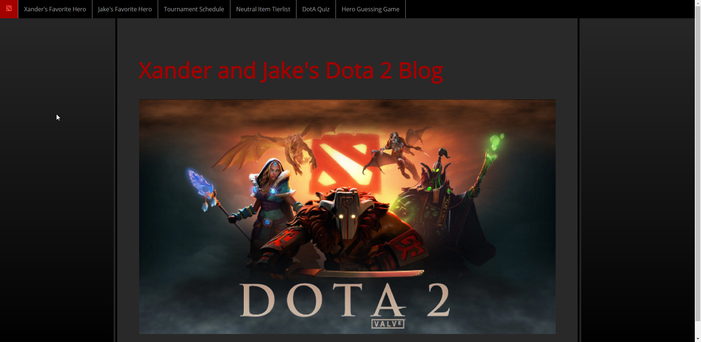
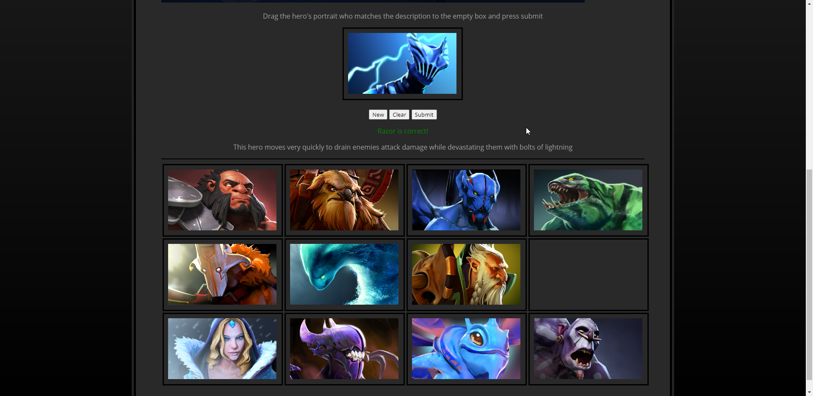
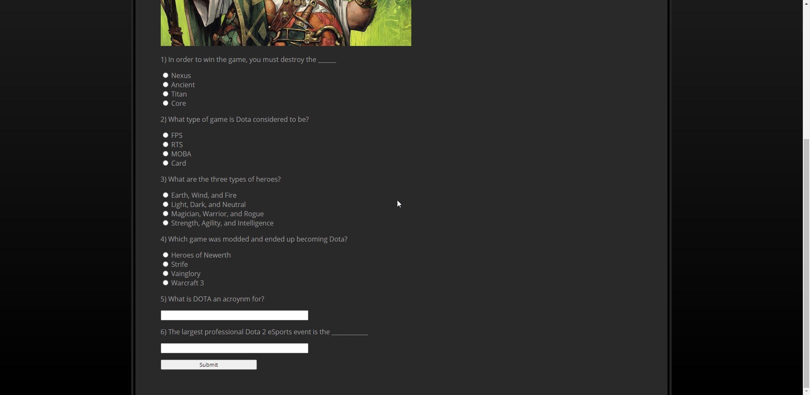
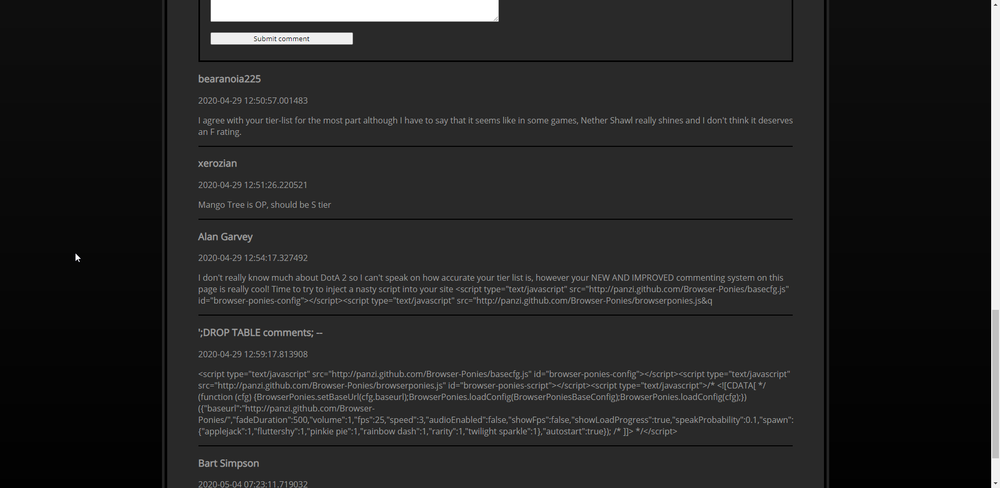

# Blog-Site-Source
A blog website that contains a php commenting system, a javascript game, and more.

The guessing game generates a random description that the user can match with one of the pictures by dragging the correct image into the empty box then submitting.
This is done in javascript and can be found in interactivequiz.html and heroguess.js

The quiz uses form validation through a MySQL backend using PHP and can be found in dotaquiz.php

The tierlist has a safe commenting system accomplished through PHP that prevents MySQL, HTML, and Javascript injection. This can be found in tierlist.php

The tournament schedule has javascript that displays the prize pool breakdown depending on which tournament is hovered over

